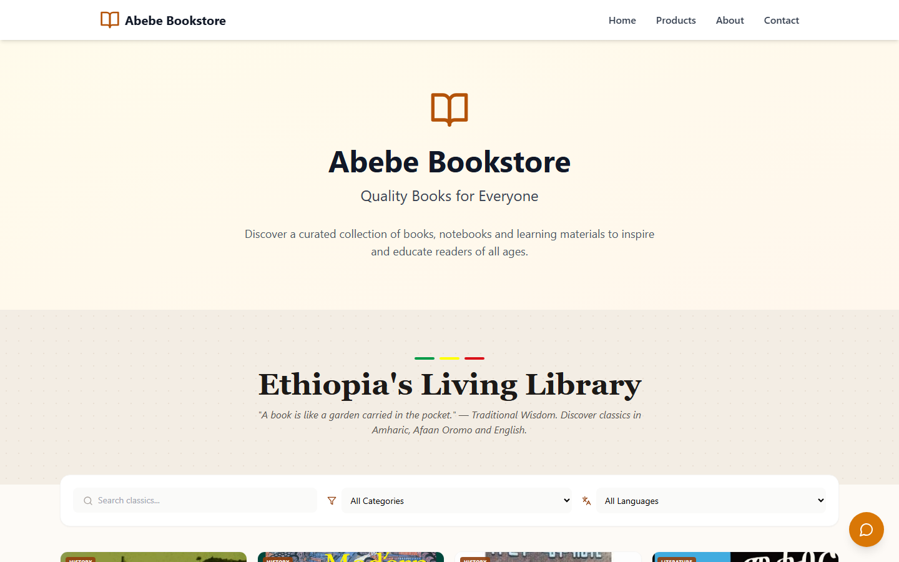
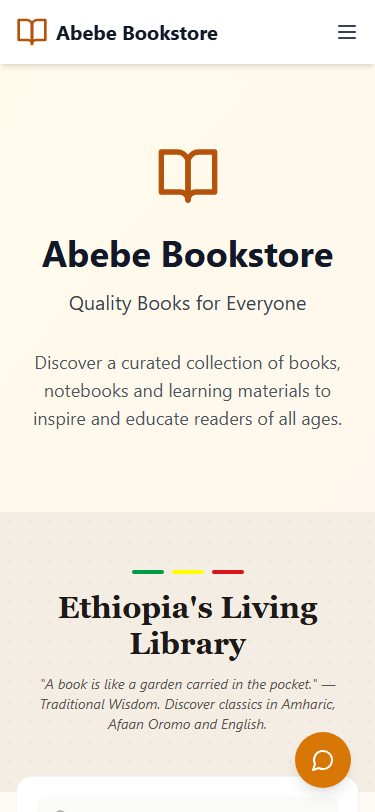
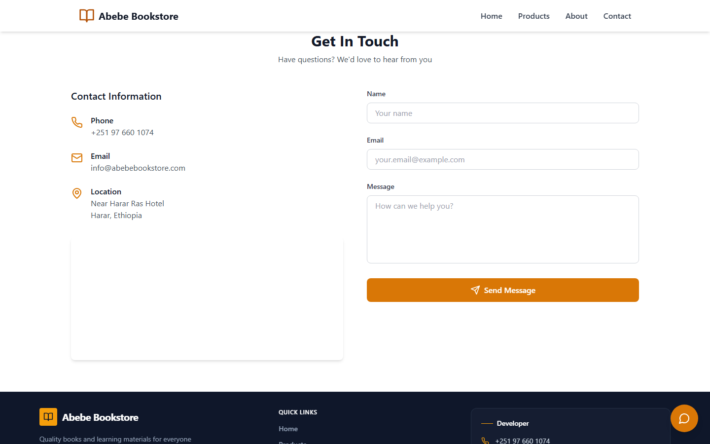
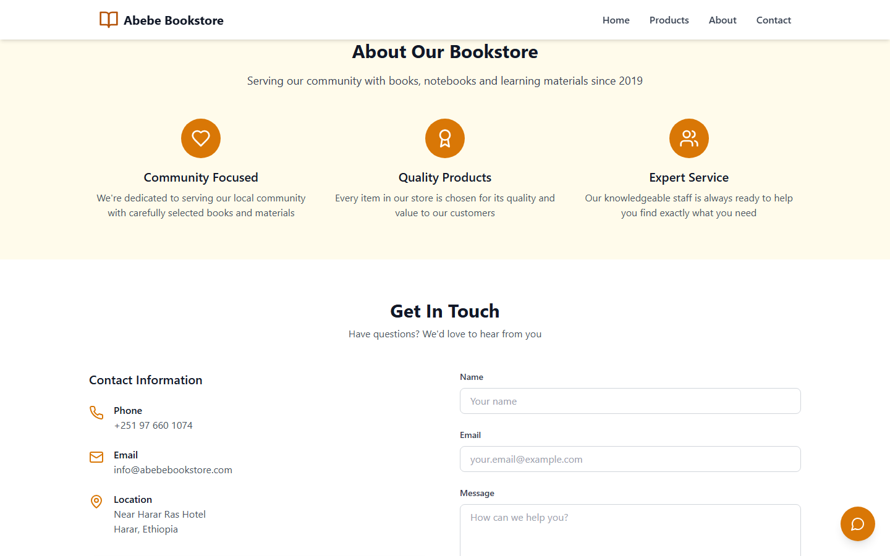

# Abebe Bookstore

**Abebe Bookstore** is a modern, responsive web application for showcasing Ethiopian books, learning materials and cultural literature. The website allows users to browse categories, view book details and contact the store directly. It's built with **React**, **TypeScript** and **Tailwind CSS** for a fast and interactive experience.

---

## Live Demo

[Click here to view the live demo](https://abebebookstore.vercel.app/)

---

## Screenshots

| | | |
|:---:|:---:|:---:|
| 🏠 **Home Page** | 📚 **Book Catalog** | 📖 **Book Details** |
|  |  |  |
| 📱 **Mobile View** | 📝 **Contact Form** | ℹ️ **About Section** |
|  |  |  |

---

## Features

- **Browse Books:** Filter by category, language and search by title or author.
- **Featured Products:** Highlighted classics and popular books.
- **Book Details:** Detailed view with description, rating, price and in-library status.
- **Wishlist:** Mark favorite books.
- **Contact Section:** Users can send messages via a contact form, call, or reach via Telegram.
- **Responsive Design:** Works across mobile, tablet and desktop.
- **Developer Info:** Contact the developer via email, phone, Telegram or GitHub.

---

## Book Categories

- History
- Literature
- Business
- Language
- Children & Folktales
- Culture

Languages available include **Amharic**, **Afaan Oromo**, **English** and **Bilingual** books.

---

## Tech Stack

- **Frontend:** React, TypeScript
- **Routing:** React Router
- **Styling:** Tailwind CSS
- **Icons:** Lucide React
- **Testing:** Vitest, React Testing Library
- **Build Tool:** Vite
- **Deployment:** Vercel

---

## Getting Started

### Clone the repository:

```bash
git clone https://github.com/gemachistesfaye/Abebe-Bookstore
cd Abebe-Bookstore
```

Install dependencies:

```bash
npm install
```

Start the development server:

```bash
npm run dev
```

Open [http://localhost:5173](http://localhost:5173) to view it in the browser.

---

### Available Scripts

| Command | Description |
|---|---|
| `npm run dev` | Start Vite dev server |
| `npm run build` | Production build |
| `npm run preview` | Preview production build |
| `npm run lint` | Run ESLint |
| `npm run typecheck` | Run TypeScript type checking |
| `npm run test` | Run tests once |
| `npm run test:watch` | Run tests in watch mode |

---

### Project Structure

```
Abebe-Bookstore/
├── public/
│   ├── images/                  # Static book cover images
│   └── screenshots/             # App screenshots for README
│       ├── home-page.png
│       ├── book-catalog.png
│       ├── book-details.png
│       ├── mobile-view.png
│       ├── contact-form.png
│       └── about-section.png
├── src/
│   ├── components/
│   │   ├── Navigation.tsx       # Sticky top navbar with mobile menu
│   │   ├── Hero.tsx             # Hero banner section
│   │   ├── FeaturedProducts.tsx # Product listing with search/filter
│   │   ├── ProductDetails.tsx   # Individual book detail view
│   │   ├── About.tsx            # About section
│   │   ├── Contact.tsx          # Contact form + info
│   │   ├── Footer.tsx           # Footer with links
│   │   ├── FloatingContactButtons.tsx # Social media buttons
│   │   └── ErrorBoundary.tsx    # Error boundary component
│   ├── data/
│   │   ├── books.json           # Book data (18 books)
│   │   └── books.ts             # Typed wrapper for book data
│   ├── types/
│   │   └── book.ts              # Book TypeScript interface
│   ├── test/
│   │   └── setup.ts             # Test setup file
│   ├── App.tsx                  # Root component with routing
│   ├── main.tsx                 # Application entry point
│   └── index.css                # Global styles (Tailwind)
├── .env.example                 # Environment variable template
├── index.html                   # Vite HTML entry point
├── package.json                 # Dependencies & scripts
├── tsconfig.json                # TypeScript configuration
├── vite.config.ts               # Vite configuration
└── vitest.config.ts             # Vitest test configuration
```

---

## Environment Variables

Create a `.env` file based on `.env.example`:

```
VITE_FORMSPREE_ID=your_formspree_id_here
```

---

## Contact & Developer Info

- **Phone:** [+251 97 660 1074](tel:+251976601074)
- **Email:** [gemachistesfaye36@gmail.com](mailto:gemachistesfaye36@gmail.com)
- **Telegram Channel:** [GemachisTesfaye](https://t.me/GemachisTesfaye)
- **GitHub Profile:** [gemachistesfaye](https://github.com/gemachistesfaye)

---

## Developer

Abebe Bookstore — Quality Ethiopian books, cultural stories and learning materials, built with love by Gemachis Tesfaye.
