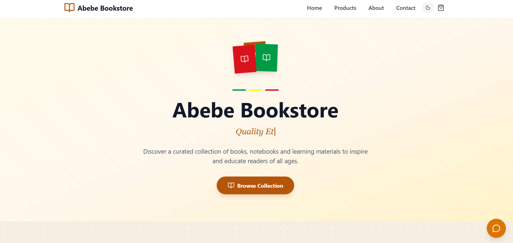
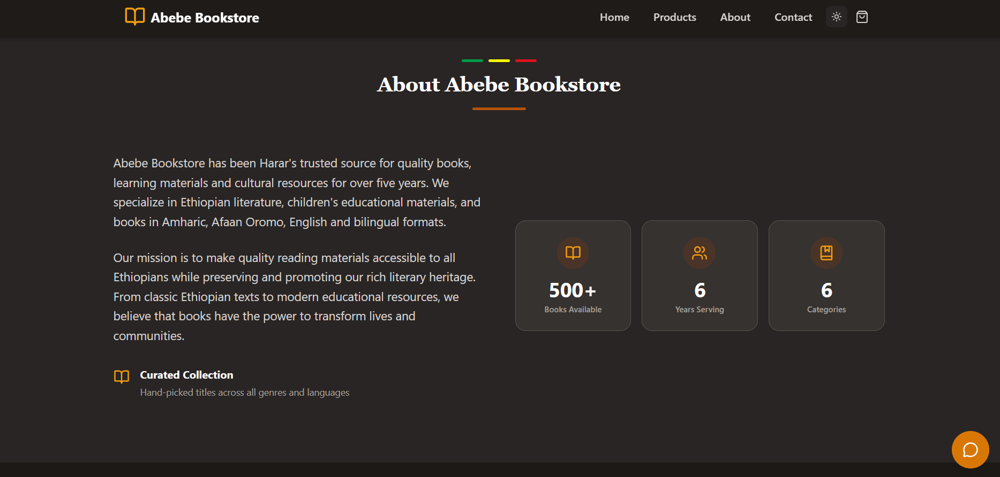
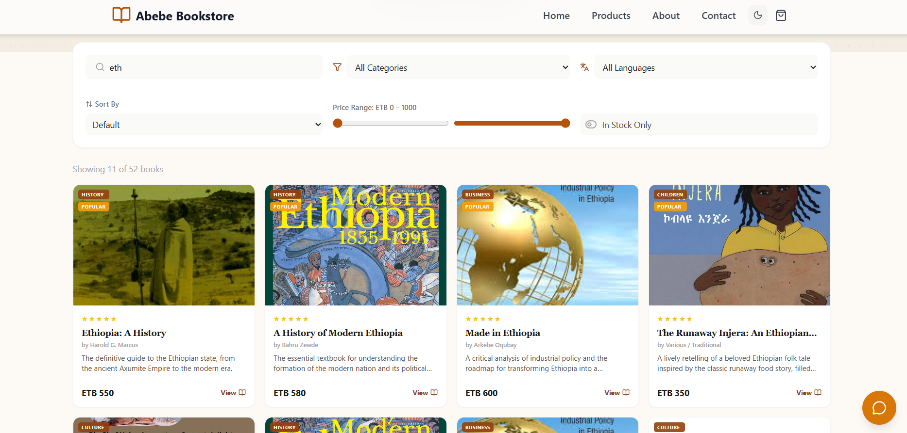
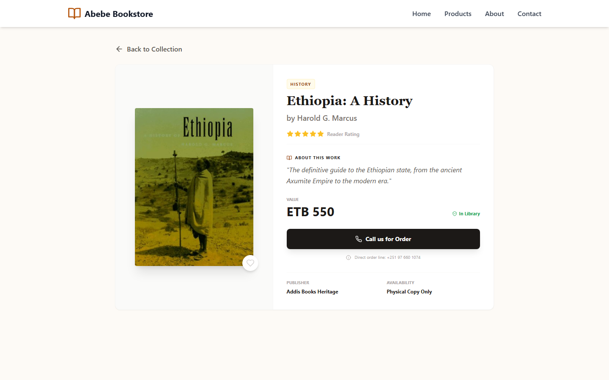
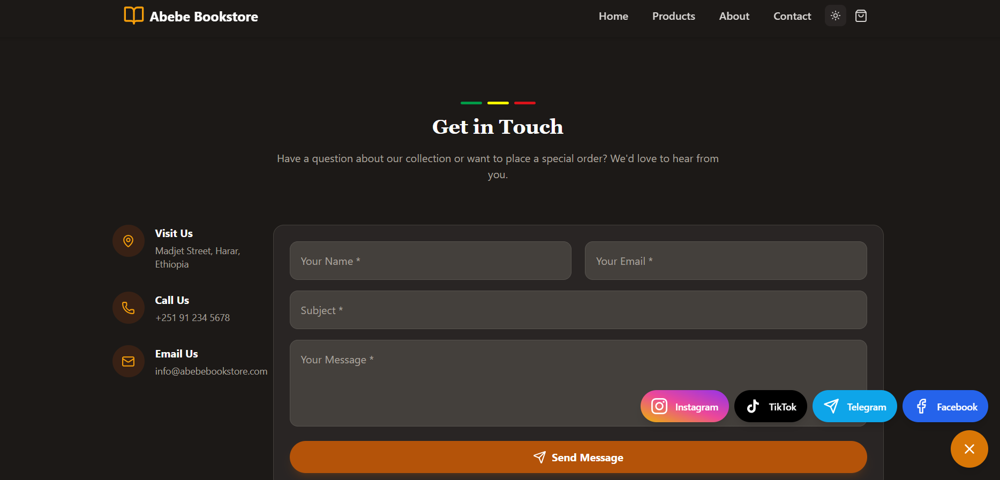
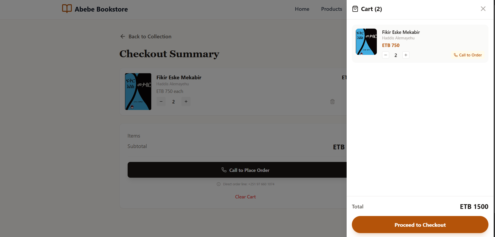
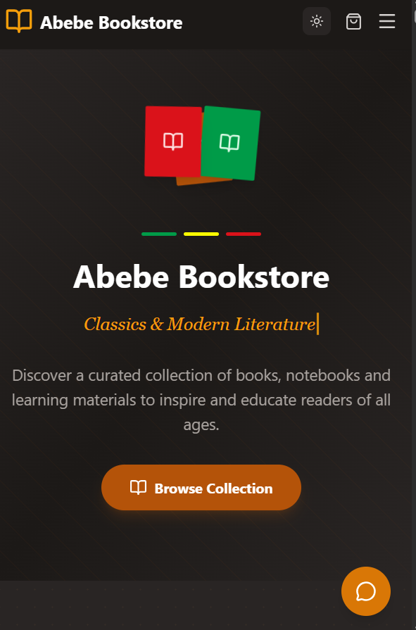
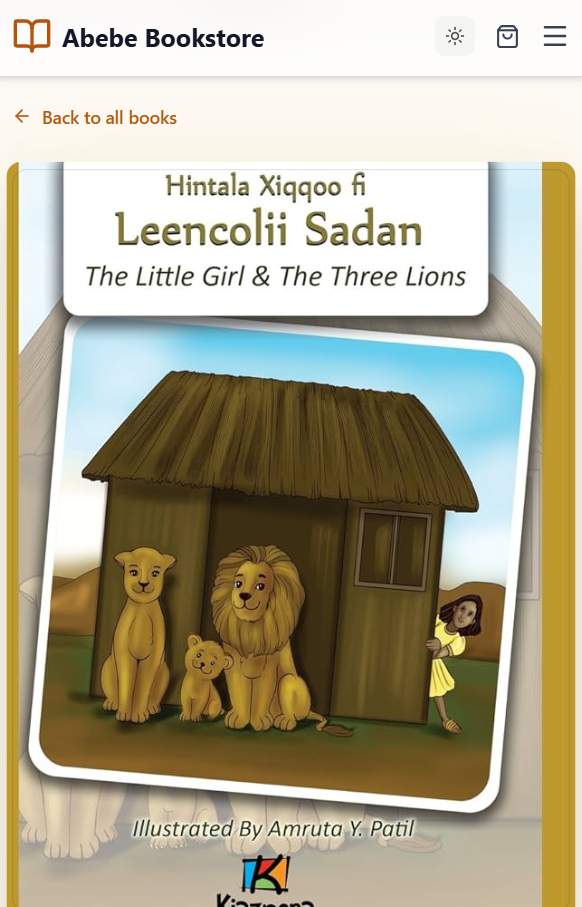
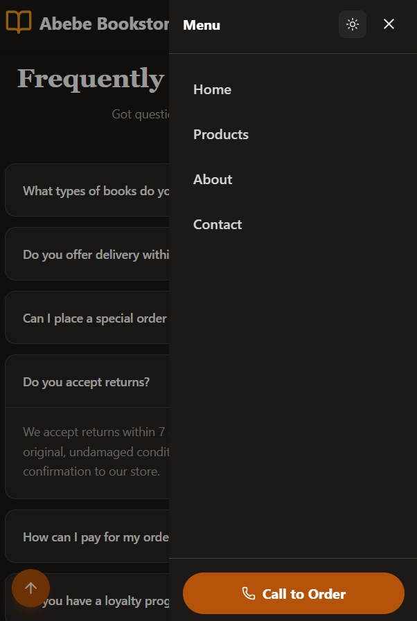

# Abebe Bookstore 📚

A modern, responsive bookstore web app for discovering Ethiopian books, cultural literature and learning materials — built with React, TypeScript and Tailwind CSS.

> Browse books by category and language, add to cart and place your order with a single call.

**Live demo →** [abebebookstore.vercel.app](https://abebebookstore.vercel.app/)

---

## Screenshots

### Desktop

| 🏠 Home | ℹ️ About | 📚 Catalog |
|:---:|:---:|:---:|
|  |  |  |

| 📖 Book Details | 📝 Contact | 🛒 Checkout |
|:---:|:---:|:---:|
|  |  |  |

### Mobile

| 📱 Home | 📱 Catalog | 📱 Menu |
|:---:|:---:|:---:|
|  |  |  |

---

## Features ✨

- **Book catalog** — filter by category, language, search by title or author
- **Book details** — full view with description, rating, price and availability
- **Shopping cart** — add items, adjust quantities, slide-out cart drawer
- **Checkout** — order summary with call-to-order flow
- **Wishlist** — save favourite books across sessions
- **Dark mode** — full dark/light theme toggle on all pages
- **Animations** — smooth page transitions and scroll-reveal effects (Framer Motion)
- **Floating social buttons** — Facebook, Telegram, TikTok, Instagram with animated expand
- **Mobile menu** — slide-out nav with dark mode toggle and call-to-order button
- **Scroll to top** — back-to-top button on mobile
- **Contact form** — send a message via Formspree, or call and reach on Telegram
- **FAQ section** — common questions answered in an accordion
- **Responsive** — works on mobile, tablet and desktop

---

## Book categories

| Category | Languages |
|---|---|
| History | Amharic, Afaan Oromo, English, Bilingual |
| Literature | Amharic, Afaan Oromo, English, Bilingual |
| Business | Amharic, English |
| Language | Amharic, Afaan Oromo, English |
| Children & Folktales | Amharic, Afaan Oromo, Bilingual |
| Culture | Amharic, English, Bilingual |

---

## Tech stack 🛠

| Layer | Tools |
|---|---|
| Frontend | React, TypeScript |
| Routing | React Router |
| Styling | Tailwind CSS |
| Animations | Framer Motion |
| Icons | Lucide React |
| State | React Context API + localStorage |
| Testing | Vitest, React Testing Library |
| Build | Vite |
| Deployment | Vercel |
| Contact form | Formspree |

---

## Getting started

```bash
git clone https://github.com/gemachistesfaye/Abebe-Bookstore
cd Abebe-Bookstore
npm install
npm run dev
```

Open [http://localhost:5173](http://localhost:5173) in your browser.

### Environment variables

Create a `.env` file based on `.env.example`:

```
VITE_FORMSPREE_ID=your_formspree_id_here
```

---

## Available scripts

| Command | Description |
|---|---|
| `npm run dev` | Start Vite dev server |
| `npm run build` | Production build |
| `npm run preview` | Preview production build |
| `npm run lint` | Run ESLint |
| `npm run typecheck` | Run TypeScript type checking |
| `npm run test` | Run tests once |
| `npm run test:watch` | Run tests in watch mode |

---

## Project structure

```
Abebe-Bookstore/
├── public/
│   ├── images/               # Book cover images
│   └── screenshots/          # App screenshots for README
├── src/
│   ├── components/
│   │   ├── Navigation.tsx        # Sticky navbar + mobile menu
│   │   ├── Hero.tsx              # Hero banner
│   │   ├── FeaturedProducts.tsx  # Book grid with search & filters
│   │   ├── ProductDetails.tsx    # Individual book page
│   │   ├── CartDrawer.tsx        # Slide-out cart sidebar
│   │   ├── CheckoutPage.tsx      # Checkout summary
│   │   ├── About.tsx             # About section
│   │   ├── Contact.tsx           # Contact form + info
│   │   ├── Footer.tsx            # Footer with links
│   │   ├── FAQ.tsx               # FAQ accordion
│   │   ├── FloatingContactButtons.tsx  # Social media buttons
│   │   ├── DarkModeToggle.tsx    # Dark/light mode toggle
│   │   ├── ScrollReveal.tsx      # Scroll animation wrapper
│   │   └── ErrorBoundary.tsx     # Error boundary
│   ├── context/
│   │   └── CartContext.tsx       # Cart + wishlist state (localStorage)
│   ├── data/
│   │   ├── books.json            # Book data
│   │   └── books.ts              # Typed data wrapper
│   ├── types/
│   │   └── book.ts               # Book TypeScript interface
│   ├── test/
│   │   └── setup.ts              # Test setup
│   ├── App.tsx                   # Root component + routing
│   ├── main.tsx                  # App entry point
│   └── index.css                 # Global styles (Tailwind)
├── .env.example
├── index.html
├── package.json
├── vite.config.ts
└── vitest.config.ts
```

---

## Payment 💳

This is a front-end only application — there is no backend or payment processing. Users browse and add books to cart, then call **[+251 97 660 1074](tel:+251976601074)** to place their order.

---

## Contact & developer info 📞

| | |
|---|---|
| Phone | [+251 97 660 1074](tel:+251976601074) |
| Email | [gemachistesfaye36@gmail.com](mailto:gemachistesfaye36@gmail.com) |
| Telegram | [@GemachisTesfaye](https://t.me/GemachisTesfaye) |
| GitHub | [gemachistesfaye](https://github.com/gemachistesfaye) |

---

## Contributing 🤝

Contributions are welcome! Please read the [Contributing Guide](.github/CONTRIBUTING.md) and [Code of Conduct](.github/CODE_OF_CONDUCT.md) before opening a pull request.

For security vulnerabilities, see the [Security Policy](.github/SECURITY.md).

---

## License

MIT — see [LICENSE](LICENSE) for details.

---

*Abebe Bookstore — quality Ethiopian books, cultural stories and learning materials, built with love by Gemachis Tesfaye.*